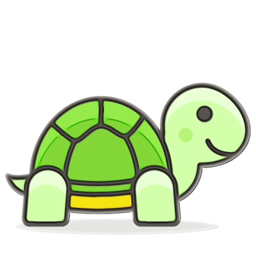

# Python Turtle Graphics Playground

Welcome to the Python Turtle Graphics Playground! This repository serves as a fun and educational resource for Python programming enthusiasts to explore the versatile capabilities of the Turtle graphics library.

## What is Turtle Graphics?
Turtle graphics is a popular module in Python that allows users to create graphics and shapes using a virtual 'turtle' that moves around the screen. Originally inspired by the Logo programming language, Turtle graphics provides a simple and intuitive way to introduce programming concepts such as loops, conditionals, and functions in a visual manner.

## Advantages of Using Turtle Graphics for Python Programming Practice:
- Ease of Learning: Turtle graphics provides a beginner-friendly environment for learning Python programming. Its simple commands and immediate visual feedback make it accessible to users of all ages and skill levels.

- Interactive Exploration: With Turtle graphics, you can dynamically create and manipulate shapes, patterns, and drawings directly on the screen. This interactive approach fosters creativity and experimentation, allowing learners to explore different concepts in a playful manner.

- Visual Feedback: One of the key advantages of Turtle graphics is its visual feedback. As the turtle moves around the screen, users can observe the effects of their code in real-time, facilitating a deeper understanding of programming concepts.

- Cross-Disciplinary Learning: Turtle graphics can be used to teach various mathematical concepts such as geometry, trigonometry, and even fractals. By integrating programming with other subjects, learners can gain a holistic understanding of both programming and mathematics.

### Have Fun!
Python Turtle Graphics is not only a powerful tool for learning programming but also a source of endless fun and creativity. So let your imagination run wild, and enjoy exploring the world of Turtle graphics!

Happy Coding! 🐢🎨
